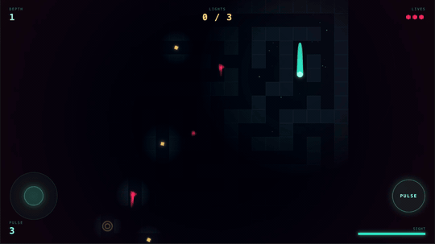

# WAKE

> **To see, you must move. To move is to be seen.**

A browser-based stealth-maze game where vision is tied to motion. Stand still and you go blind — but so do the things hunting you. Built with Next.js, HTML5 Canvas, and the Web Audio API.

<p align="center">
  
</p>

<p align="center">
  <a href="https://wake-nextjs.vercel.app"><b>▶ Play it</b></a>
  &nbsp;·&nbsp;
  <a href="#controls">Controls</a>
  &nbsp;·&nbsp;
  <a href="#run-locally">Run locally</a>
</p>

---

## The hook

Most stealth games hide the map behind fog-of-war. WAKE hides it behind *velocity*. Your vision radius scales with how fast you're moving — sprinting reveals more but draws hunters faster. The Pulse ability snaps the whole maze into focus for a heartbeat, then the dark closes back in and everything that heard it now knows where you are.

## Features

- **Procedural mazes** — recursive backtracker with bonus open rooms, regenerated every descent
- **Motion-driven sight** — vision radius bound to player velocity
- **Pulse mechanic** — full reveal at the cost of giving away your position
- **Hunter AI** — patrol + investigate states, react to pulses and footsteps
- **Lives + Depth progression** — 3 lives, infinite descents, escalating difficulty
- **Atmosphere passes** — vignette, dust particles, chromatic trails, screen-shake on hits
- **Procedural audio** — Web Audio oscillator blips, no audio files shipped
- **Mobile-first inputs** — virtual joystick with sprint-on-push, dedicated Pulse button
- **Landscape lock + fullscreen** — auto-zoom and fullscreen prompt on touch devices

## Controls

**Desktop**
| Action | Key |
|---|---|
| Move | `W` `A` `S` `D` or Arrow keys |
| Sprint | `Shift` |
| Pulse | `Space` |

**Mobile** — virtual joystick (push further to sprint) + on-screen `PULSE` button.

## Objective

Find the **three lights** scattered through each maze, then reach the **way down**. Each descent gets harder. You have three lives.

## Tech

- [Next.js 14](https://nextjs.org/) (App Router) + React 18
- HTML5 Canvas 2D — no game framework, no Three.js
- Web Audio API for procedural SFX
- Zero runtime dependencies beyond React/Next

The entire game is one component: [`app/Wake.js`](app/Wake.js).

## Run locally

```bash
npm install
npm run dev
```

Then open <http://localhost:3000>.

## Deploy

One-click on Vercel:

[](https://vercel.com/new/clone?repository-url=https://github.com/asadrao/wake-nextjs)

## License

MIT
